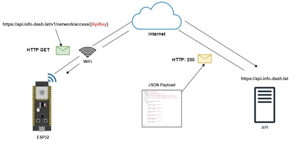

# ESP8266/ESP32 Weather Station with DHT22 Sensor and InfoDash API Integration

This code is for an ESP8266 or ESP32 based device that reads temperature and humidity values using a DHT22 sensor and sends the data to an API endpoint using HTTP POST request.

## Dependencies
- DHTesp library
- ArduinoJson library
- HTTPClient library
- WiFi library

Platformio.init
```ini
; ESP8266

; [env:nodemcuv2]
; platform = espressif8266
; board = nodemcuv2
; framework = arduino
; upload_speed = 115200
;lib_deps = 
;	bblanchon/ArduinoJson@^6.20.0
;	beegee-tokyo/DHT sensor library for ESPx@^1.19


; ESP32
[env:esp32doit-devkit-v1]
platform = espressif32
board = esp32doit-devkit-v1
framework = arduino
monitor_speed = 115200
lib_deps = 
	bblanchon/ArduinoJson@^6.20.0
	beegee-tokyo/DHT sensor library for ESPx@^1.19
```


The following code snippet represents the program header, where necessary imports are made to utilize essential libraries and functionalities. This includes the 'DHTesp' library for communication with the DHT22 sensor, 'ArduinoJson' for data manipulation in JSON format, 'HTTPClient' for executing HTTP requests, and, depending on the board type, the respective Wi-Fi connection libraries ('WiFi' for ESP32 and 'ESP8266WiFi' for ESP8266).


```C++
#include <Arduino.h>
#include "DHTesp.h"
#include <ArduinoJson.h>
#include <HTTPClient.h>
#ifdef ESP32
#include <WiFi.h>
#elif defined(ESP8266)
#include <ESP8266WiFi.h>
#endif
```

## Configuration
The following variables need to be configured for the system to work:

- `WIFI_SSID`: The SSID of the WiFi network to connect to.
- `WIFI_PASSWORD`: The password of the WiFi network.
- `HOST`: The URL of the server to send data to.
- `API_KEY`: The API key to authenticate with the server.
- `INTERVAL`: The interval (in milliseconds) between readings and transmissions.
- `DHT_Pin`: The pin number connected to the DHT22 sensor.


```C++
// WiFi credentials
const char *WIFI_SSID = "YOUR_WIFI_SSID";
const char *WIFI_PASSWORD = "YOUR_WIFI_PASSWORD";

// Info-Dash credentials
const String HOST = "https://api.info-dash.lat/v1";
const String API_KEY = "YOUR_INFO-DASH_API_KEY";

// Info-Dash
const int INTERVAL = 10000; // 10 seconds
const int DHTPin = 4;

```

## Global Variables
 
- `humidity`: A global variable to store the humidity value.
- `temperature`: A global variable to store the temperature value.
- `sendJson`: A global variable to store the JSON payload to be sent to the API endpoint.
- `dht`: DHTesp library instance.


```C++
float humidity = 0;
float temperature = 0;
String sendJson = "";
DHTesp dht;

```

## Functions
- `getSerialID()`: A function that returns the device's serial ID.

```C++
String getSerialID()
{
  uint64_t chipid = ESP.getEfuseMac();
  uint32_t chip = (uint32_t)(chipid >> 32);
  return (String)chip;
}
```

- `connectToWifi()`: A function that connects the device to the WiFi network.

```C++
bool connectToWifi()
{
  static bool tick = false;
  byte attempt = 0;

  Serial.println("Info: Connecting to WiFi...");
  WiFi.mode(WIFI_STA);
  WiFi.begin(WIFI_SSID, WIFI_PASSWORD);

  while (WiFi.status() != WL_CONNECTED)
  {
    attempt++;
    tick = !tick;
    if (attempt > 20)
      return false;
    digitalWrite(LED_BUILTIN, tick);
    delay(500);
  }
  digitalWrite(LED_BUILTIN, WiFi.status() == WL_CONNECTED ? HIGH : LOW);
  return true;
}
```

- `buildSendJson(response)`: A function that builds the JSON payload to be sent to the API endpoint. It takes a `response` parameter which is the HTTP GET response from the API endpoint.


```C++
String buildSendJson(String response)
{
  DynamicJsonDocument jsonResponse(1024);
  DynamicJsonDocument jsonPayload(1024);
  deserializeJson(jsonResponse, response);

  jsonPayload["serial"] = getSerialID();
  jsonPayload["apiKey"] = API_KEY;

  for (size_t i = 0; i < jsonResponse["stations"][0]["sensors"].size(); i++)
    jsonPayload["payloads"][i]["sensorId"] = jsonResponse["stations"][0]["sensors"][i]["sensorId"];

  String buildPayload;
  serializeJson(jsonPayload, buildPayload);
  jsonPayload.clear();
  jsonResponse.clear();
  return buildPayload;
}
```

- `connectToServer()`: A function that connects the device to the API endpoint using HTTP GET request and retrieves the sensor IDs from the API response. It also calls `buildSendJson()` to build the JSON payload to be sent.

```C++
bool connectToServer()
{
  Serial.println("Info: Connecting to server...");
  HTTPClient http;
  String url = HOST + "/network/access/" + API_KEY;

  http.begin(url);
  http.addHeader("Content-Type", "application/json");

  int httpCode = http.GET();

  if (httpCode <= 0)
    Serial.printf("Info: HTTP GET... failed, error: %s\n", http.errorToString(httpCode).c_str());
  else
  {
    Serial.printf("Info: HTTP GET... code = %d\n", httpCode);
    if (httpCode == HTTP_CODE_OK)
    {
      sendJson = buildSendJson(http.getString());
      return true;
    }
  }
  http.end();
  return false;
}
```


- `readDHT()`: A function that reads the temperature and humidity values from the DHT22 sensor.

```C++
void readDHT()
{
  temperature = dht.getTemperature();
  humidity = dht.getHumidity();
  Serial.print("\nInfo: Temperature: ");
  Serial.print(temperature);
  Serial.print("°C");
  Serial.print(" Humidity: ");
  Serial.print(humidity);
  Serial.println("%");
}
```


- `getPayload()`: A function that builds the JSON payload to be sent to the API endpoint with the updated temperature and humidity values.

```C++
String getPayload()
{
  DynamicJsonDocument doc(1024);
  deserializeJson(doc, sendJson);

  doc["payloads"][0]["value"] = (int)temperature;
  doc["payloads"][1]["value"] = (int)humidity;

  String payload;
  serializeJson(doc, payload);
  doc.clear();
  return payload;
}
```


- `sendDataByHttp()`: A function that sends the JSON payload to the API endpoint using HTTP POST request.

```C++
void sendDataByHttp()
{
  HTTPClient http;
  http.begin(host);
  http.addHeader("Content-Type", "application/json");
  String payload = getPayload();
  int httpCode = http.POST(payload);
  Serial.println("Info: HTTP POST..code = " + (String)httpCode);
  http.end();
}
```


## Setup
- `Serial.begin(115200)`: Initializes the serial communication at a baud rate of 115200.
- `delay(1000)`: Waits for 1 second.
- `dht.setup(DHTPin, DHTesp::DHT22)`: Initializes the DHT22 sensor.
- `pinMode(LED_BUILTIN, OUTPUT)`: Sets the built-in LED pin as an output pin.
- `digitalWrite(LED_BUILTIN, LOW)`: Turns off the built-in LED.
- `connectToWifi()`: Connects the device to the WiFi network.

```C++
void setup()
{
  Serial.begin(115200);
  delay(1000);

  Serial.println("Info: Starting...");
  Serial.println("Info: Serial ID: " + getSerialID());
  delay(2000);

  dht.setup(DHTPin, DHTesp::DHT22);

  pinMode(LED_BUILTIN, OUTPUT);
  digitalWrite(LED_BUILTIN, LOW);
  connectToWifi();
}
```


## Loop
- `isWiFiConnected`: A boolean variable that checks if the device is connected to the WiFi network.
- `isConnectedToServer`: A boolean variable that checks if the device is connected to the API endpoint.
- `currentMillis`: An unsigned long variable that stores the current time in milliseconds.
- `readDHT()`: Calls the `readDHT()` function to read the temperature and humidity values.
- `digitalWrite(LED_BUILTIN, isWiFiConnected ? HIGH : LOW)`: Turns on the built-in LED if the device is connected to the WiFi network, otherwise turns it off.
- `if (isWiFiConnected)`: Checks if the device is connected to the WiFi network.
- `if (isConnectedToServer)`: Checks if the device is connected to the API endpoint.
- `sendDataByHttp()`: Calls the `sendDataByHttp()` function to send the JSON payload to the API endpoint using HTTP POST request.
- `isConnectedToServer = connectToServer()`: Calls the `

```C++
void loop()
{
  static bool isConnectedToServer = false;
  static unsigned long currentMillis = millis();

  if (millis() - currentMillis > INTERVAL)
  {
    bool isWiFiConnected = WiFi.status() == WL_CONNECTED;
    currentMillis = millis();
    readDHT();
    digitalWrite(LED_BUILTIN, isWiFiConnected ? HIGH : LOW);

    if (isWiFiConnected)
    {
      if (isConnectedToServer)
        sendDataByHttp();
      else
        isConnectedToServer = connectToServer();
    }
  }
}
```

## Annexes

This annex provides a visual representation of the HTTP request configuration used in the program. 



This annex offers a visual representation of an ESP32 device with a DHT22 sensor executing the program. 


